# ShopHub — an ecommerce operations platform

**Agile & DevOps laboratory submission**

|  |  |
|---|---|
| **Name** | Sarthak Pagare |
| **Email** | sarthakpagare005@gmail.com |
| **Repository** | https://github.com/nglfrsarthak/shop-hub |
| **Toolchain** | Jira (the work) + GitHub (the code) — and nothing else |
| **Pipeline** | Continuous integration, never continuous deployment |
| **Latest commit** | `deb5d0e` — *fix: align the lifecycle and payment rules with the Jira acceptance criteria* |
| **Suite** | `npm test` → 78 acceptance tests / 8 suites; `npm run smoke` → 30 checks |

---

## 1. Short description

ShopHub is an ERP-style backend and browser console for a mid-size online
retailer. It implements the whole trading loop of an online store — a catalogue
of products, SKUs and prices; a server-side cart; checkout that reserves stock;
a closed order state machine; idempotent card payments; returns, refunds and
reconciliation; fulfilment with dispatch and tracking; and role-scoped reporting
over an append-only audit ledger.

The schema has **18 tables** and the HTTP surface has **51 endpoints**, described
by the API's own `GET /api/v1/meta`. Money is always an **integer number of
paise**; stock is always explained by a movement ledger; and every state change
is checked against a closed state machine. There are **six roles** — customer,
agent, warehouse, merchandiser, finance, admin — and every endpoint that mutates
data is scoped to the roles allowed to call it.

The toolchain is deliberately and strictly two tools: **Jira** for the work,
**GitHub** for the code. The work items on the board are the specification; the
commits on GitHub are the implementation; and a single CI workflow on every push
is the only automated gate. A `Dockerfile` exists, but it is local run
convenience only — **CI neither builds nor publishes an image**.

This document is the submission. Every screenshot in it was captured from the
real tool by driving a real browser or running the real command; nothing was
redrawn, mocked or simulated. Where evidence could not be captured, it is shown
as an explicit placeholder with instructions, never as a fabricated image.

---

## 2. Theory

### §2.1 Two tools, and only two

The brief for this lab is a two-tool toolchain: **Jira** for the work, **GitHub**
for the code. This is a constraint, and constraints are useful — they force the
boundary between the two tools to be clean. Jira owns *what* is being built:
epics, stories, acceptance criteria, the sprint. GitHub owns *how* it is built:
the commits, the reviewable history, the CI workflow. Neither tool tries to do
the other's job, so there is exactly one place to look for "what is planned" and
exactly one place to look for "what is true".

### §2.2 Epics, stories, acceptance criteria and the Definition of Done

Work is organised the way Agile practice prescribes:

- An **epic** is a large slice of value (for example, *E3 — stock levels and the
  no-oversell rule*).
- A **story** is a small, independently deliverable unit phrased from the user's
  point of view: *As a `<role>`, I want `<goal>` so that `<benefit>`*.
- **Acceptance criteria (ACs)** are the testable statements that decide whether
  the story is done. An AC that cannot be turned into a passing test is not an
  AC, it is a wish.

The **Definition of Done** used here is strict: a story is Done only when every
one of its acceptance criteria is exercised by an automated test that passes,
and the code is committed and green in CI. This is why the test suite is
organised by epic — `E1` through `E7` — so that the distance between a line of
Jira and a line of code is one test name.

### §2.3 The pipeline: continuous integration, never continuous deployment

**Continuous integration** means every push is automatically built and verified.
That is the whole pipeline here. **Continuous deployment** — automatically
shipping a green build to production — is deliberately *not* used. This lab is
about the inner loop: how a change moves from a story, through a commit, to a
verified build. Deployment adds environment-specific concerns (hosting,
secrets, migration) that are out of scope, and pretending otherwise would make
the evidence weaker, not stronger. The `Dockerfile` builds a container that runs
the app locally for convenience; CI does not touch it.

### §2.4 Evidence over assertion

Every claim in this submission is backed by a real artefact: a screenshot of the
real tool, or the real output of the real command, captured by a script. The
capture scripts (`scripts/capture-shots.mjs`, `scripts/code-output-shots.mjs`)
drive a real browser over the Chrome DevTools Protocol and run the real commands,
writing the bytes they saw next to the image. Nothing is redrawn. Where a piece
of evidence genuinely cannot be produced — the Jira burndown chart on the free
plan, for instance — the submission says so plainly and shows a placeholder
instead.

### §2.5 Invariants

An invariant is a statement that must be true at every moment, not merely after
a particular request. The system enforces and tests several:

- `on_hand` equals the sum of that variant's stock movements.
- `on_hand` and `reserved` are never negative, and `reserved` never exceeds
  `on_hand`.
- Every order total is internally consistent (`total = subtotal + tax + shipping`).
- No order holds stock it does not own.
- Every meaningful write leaves an audit event.

### §2.6 Money is an integer number of paise

Floating-point money drifts. Every monetary column in the schema is an integer,
in paise (1 rupee = 100 paise), and every price, tax and shipping figure is
computed in integers. The suite has a test that asserts no money column is ever
stored as a float, and another that reproduces a cart total by hand and compares
it exactly.

### §2.7 Closed state machines

Orders, returns and tracking events each move through a **closed** sequence: a
transition is legal only if it appears in an explicit map, and everything else is
refused with `422` and the list of states that *are* legal. Crucially, the
status endpoint refuses the transitions that move money or stock —
`→ shipped` and `→ cancelled` — and names the endpoint that must be used
instead. A closed machine means an invalid state is unrepresentable, not merely
unlikely.

### §2.8 Idempotency

A customer who taps "pay" twice must be charged once. Payments require an
`idempotency_key`; replaying a key returns the original payment with
`replayed: true` and writes no second row. Two concurrent requests with the same
key produce exactly one payment row. The same discipline governs "mark this
notification read" — the second call is a no-op, not an error.

### §2.9 Role-based access control

Every list and mutation is scoped to the roles permitted to see or change it. A
customer sees only their own orders and returns; a warehouse operator sees
inventory and a dispatch queue; finance sees the payment ledger and
reconciliation; admin sees the audit ledger. Refusals are meaningful: a `403`
names the roles that *would* have been allowed, so a programmer reading the
response knows what to change.

---

## 3. Jira — the work

### §3.1 The project and the board

The project is **SCRUM** in Jira Cloud, on a scrum board backed by a backlog. It
holds seven epics (`E1`–`E7`) and 26 work items. The audit that closes this lab
moved the last 16 stories to **Done**, so the board's Done column now holds every
item in the sprint.

**SS-1 — The board after the audit.**

| Field | Value |
|---|---|
| **Tool** | Jira Cloud |
| **Where** | `https://sarthakpagare005.atlassian.net/jira/software/projects/SCRUM/boards/1` |
| **Must show** | The board with every column visible and the Done column populated — To Do `0`, In Progress `0`, In Review `0`, Done `26` |
| **Why** | Shows the Definition of Done from §2.2 satisfied for the whole sprint; the board is the single source of "what is planned" from §2.1 |

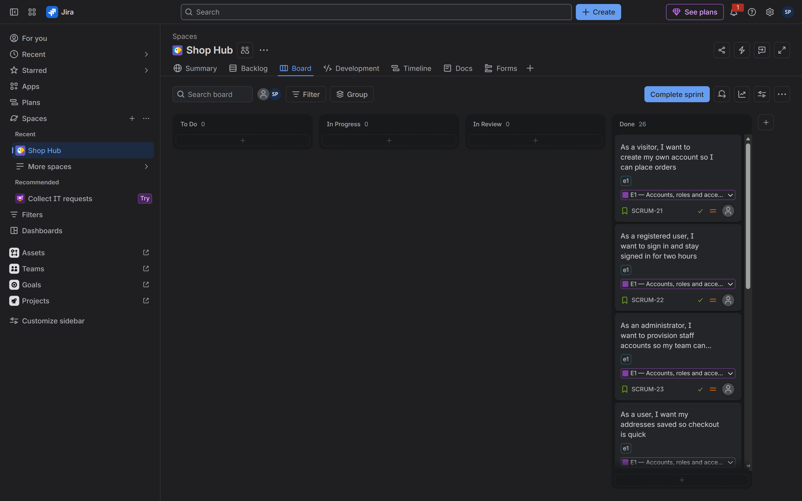

### §3.2 The backlog and the epics

The backlog is grouped by epic, so each story sits directly under the value it
delivers. The seven epics are:

| Epic | Theme | Stories |
|---|---|---|
| E1 | Accounts, roles, addresses and notifications | 4 |
| E2 | Catalogue, SKUs and pricing | 4 |
| E3 | Stock levels and the no-oversell rule | 4 |
| E4 | Cart, checkout and the order lifecycle | 5 |
| E5 | Payments, returns and refunds | 4 |
| E6 | Fulfilment, dispatch and tracking | 3 |
| E7 | Reporting and audit | 2 |

**SS-2 — The backlog grouped by epic.**

| Field | Value |
|---|---|
| **Tool** | Jira Cloud |
| **Where** | Backlog view of project SCRUM |
| **Must show** | The epics, with their stories nested beneath them and statuses visible |
| **Why** | Shows the epic → story → acceptance-criteria hierarchy described in §2.2 |

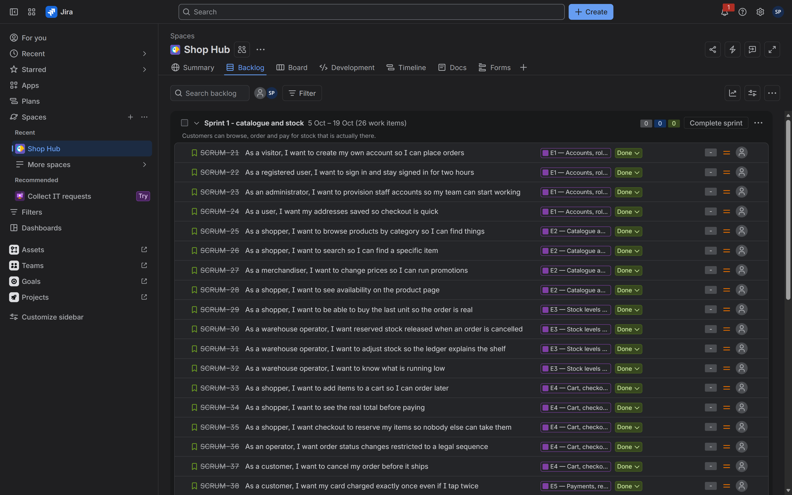

### §3.3 A story and its acceptance criteria

Every story carries its ACs on the issue itself. The example below is the
no-oversell story, which is the one that turns a race condition into an
invariant.

**SS-3 — A story with its acceptance criteria.**

| Field | Value |
|---|---|
| **Tool** | Jira Cloud |
| **Where** | Issue detail, e.g. `/browse/SCRUM-29` |
| **Must show** | The story statement and the numbered acceptance criteria |
| **Why** | Acceptance criteria are the contract that §2.2 says must be testable; this is where the contract lives |

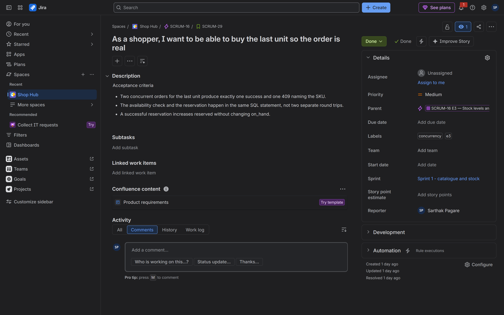

### §3.4 An epic and its children

**SS-4 — An epic with its child stories.**

| Field | Value |
|---|---|
| **Tool** | Jira Cloud |
| **Where** | Epic detail, e.g. `/browse/SCRUM-16` (E3) |
| **Must show** | The epic's stories and their statuses |
| **Why** | Shows that an epic is a delivery slice, and its children are the units of Done (§2.2) |

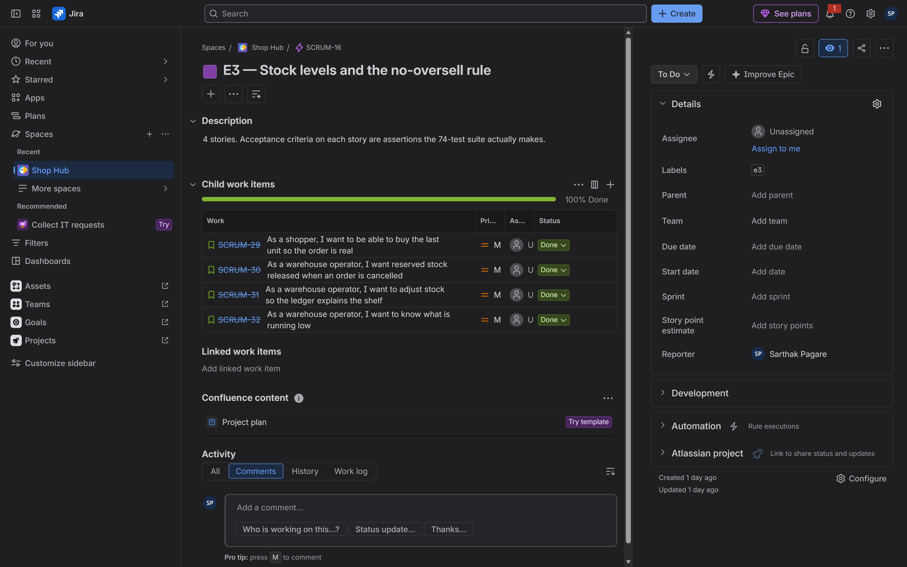

### §3.5 The sprint

Work was time-boxed into a single sprint. The sprint panel records the name,
goal and dates, which is what a burndown is drawn against.

**SS-5 — The sprint panel.**

| Field | Value |
|---|---|
| **Tool** | Jira Cloud |
| **Where** | Board → Sprint details |
| **Must show** | Sprint name, goal, start and end dates |
| **Why** | The time-box is the unit of planning in §2.2 |

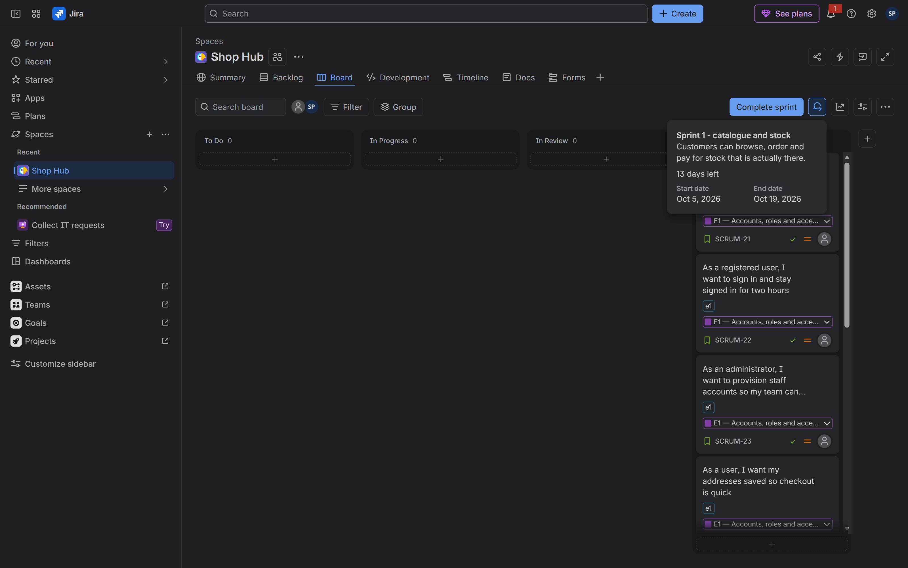

### §3.6 The burndown chart — not captured, and why

**Placeholder — no image is shown, because none could be captured.**

| Field | Value |
|---|---|
| **Tool** | Jira Cloud |
| **Capture** | Board → Reports → Burndown |
| **Must show** | The remaining-work line falling to zero by the sprint end date |
| **Why** | It would visualise the sprint completion implied by §3.5 |
| **Where to capture** | `https://sarthakpagare005.atlassian.net/jira/software/projects/SCRUM/boards/1` → *Reports* → *Burndown* |

This screenshot could not be captured because the **Jira free plan does not
include the Reports / burndown feature**. Rather than draw a chart that was
never produced by the tool, this submission states the gap. The completion it
would have shown is, however, directly evidenced: every item in the sprint is in
Done (SS-1), and the sprint panel records the time-box (SS-5).

### §3.7 Closing the loop: the audit and the fix commit

The last task was an explicit audit. Every open story's acceptance criteria were
compared, line by line, against the code. All **16 open stories / 53 acceptance
criteria** were checked. Most were already satisfied; the differences were
collected into a single commit, `deb5d0e`, so that one commit closes the gap
between the board and the code. The stories were then moved to Done.

| Story | Epic | ACs | Outcome of the audit |
|---|---|---|---|
| SCRUM-31 | E3 | 3 | Already met — movements and audit on every adjustment |
| SCRUM-32 | E3 | 3 | Already met — `on_hand − reserved` compared to the reorder point |
| SCRUM-33 | E4 | 3 | Already met — 409 with SKU and available quantity |
| SCRUM-34 | E4 | 3 | Already met — integer paise, 18% GST, free shipping at ₹500 |
| SCRUM-35 | E4 | 3 | Already met — reservation and order created in one transaction |
| SCRUM-36 | E4 | 4 | **Changed** — status `placed` renamed `created`; `422` now reports `allowed`; shipped is terminal |
| SCRUM-37 | E4 | 3 | Already met — cancel releases stock; paid cancel refunds in the same call |
| SCRUM-38 | E5 | 3 | **Changed** — a missing/short `idempotency_key` is now `422`, not `400` |
| SCRUM-39 | E5 | 3 | **Changed** — a declined card writes **no** payments row; the failure is audited |
| SCRUM-40 | E5 | 3 | **Changed** — failed attempts are counted from the audit ledger, not a phantom row |
| SCRUM-41 | E5 | 5 | **Changed** — added the `in_transit` step to the closed return sequence |
| SCRUM-42 | E6 | 3 | **Changed** — added `GET /fulfilment/dispatch-queue` (paid + picking, FIFO) |
| SCRUM-43 | E6 | 3 | **Changed** — the re-dispatch `409` now carries the shipment reference |
| SCRUM-44 | E6 | 3 | Already met — append-only tracking events with a closed sequence |
| SCRUM-45 | E7 | 5 | Already met — the API chooses the dashboard per role |
| SCRUM-46 | E7 | 3 | Already met — append-only audit ledger, admin-only |

The two changes that touched a state machine are worth quoting, because they are
where the theory of §2.7 becomes code:

```js
// app/src/routes/orders.js
export const ORDER_FLOW = {
  created:   ['paid', 'cancelled'],
  paid:      ['picking', 'cancelled'],
  picking:   ['packed', 'cancelled'],
  packed:    ['shipped'],
  shipped:   ['delivered'],
  delivered: [],
  cancelled: [],
};

// The status endpoint may not perform the transitions that move stock or money.
export const WORKFLOW_FLOW = {
  created:   [],
  paid:      ['picking'],
  picking:   ['packed'],
  packed:    [],
  shipped:   [],
  delivered: [],
  cancelled: [],
};
```

```js
// app/src/routes/payments.js
export const RETURN_FLOW = {
  requested:  ['approved', 'rejected'],
  approved:   ['in_transit'],
  in_transit: ['received'],
  received:   ['refunded'],
  refunded:   [],
  rejected:   [],
};
```

---

## 4. GitHub — the code and the pipeline

### §4.1 The repository

The repository is public and its README states the shape of the system up front:
18 tables, 51 endpoints, the two-tool toolchain, and the explicit note that CI
never publishes an image.

**SS-6 — The repository.**

| Field | Value |
|---|---|
| **Tool** | GitHub |
| **Where** | `https://github.com/nglfrsarthak/shop-hub` |
| **Must show** | The rendered README, the file tree and the commit count |
| **Why** | The single source of "what is true" from §2.1 |

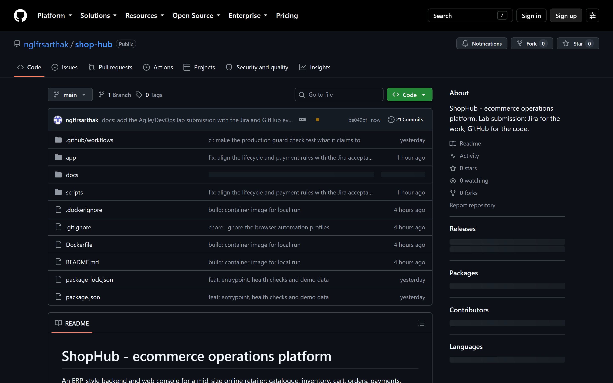

### §4.2 The commit history

History is deliberately legible: one epic or one fix per commit, with a message
that says *why*. The history reads as the build order of the schema and then one
epic per commit, ending with the audit fix.

**SS-7 — The commit history.**

| Field | Value |
|---|---|
| **Tool** | GitHub |
| **Where** | `/commits/main` |
| **Must show** | A commit list where each entry maps to one epic or one fix |
| **Why** | Reviewable history is the "how" side of the §2.1 split |

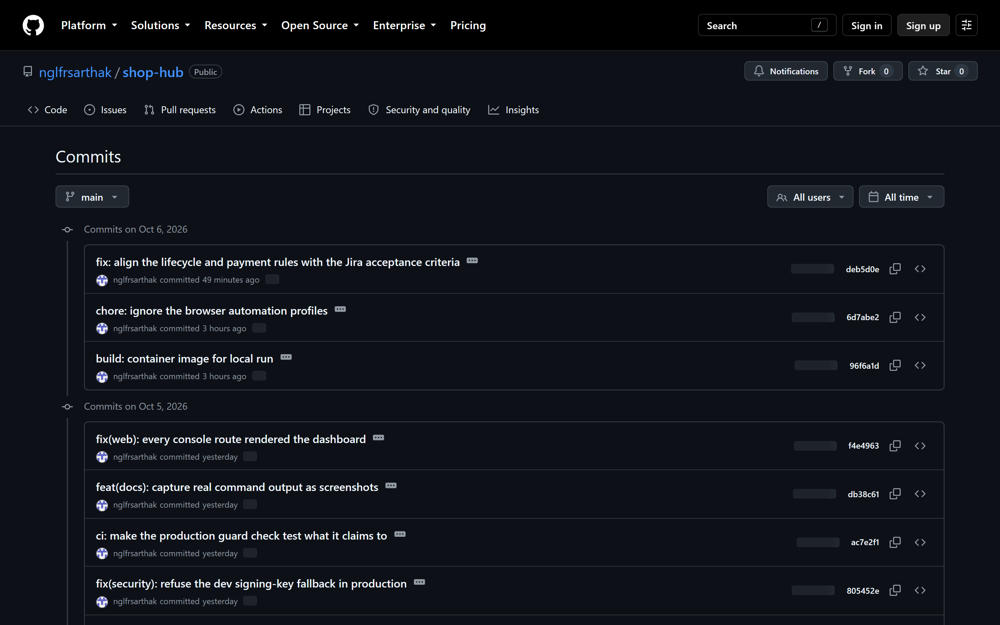

### §4.3 The no-oversell commit

The no-oversell rule is the clearest single example of an invariant enforced in
SQL rather than in application logic. The conditional `UPDATE` makes the check
and the write the same atomic statement, so two concurrent shoppers can never
both win the last unit.

```js
// app/src/routes/inventory.js
export function reserveStock(variantId, qty) {
  const info = db.prepare(`
    UPDATE stock_levels SET reserved = reserved + ?
     WHERE variant_id = ? AND (on_hand - reserved) >= ?
  `).run(qty, variantId, qty);
  return info.changes > 0;
}
```

**SS-8 — The commit that adds the no-oversell rule.**

| Field | Value |
|---|---|
| **Tool** | GitHub |
| **Where** | Commit `45c3d7b` — *feat(E3): stock levels, movements and the no-oversell rule* |
| **Must show** | The diff, including the conditional `UPDATE` above |
| **Why** | The invariant from §2.5, enforced where the race is |

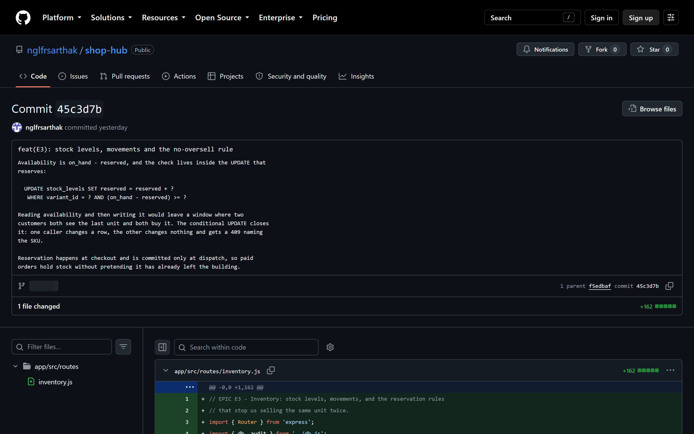

### §4.4 The source on GitHub

**SS-9 — The inventory source on GitHub.**

| Field | Value |
|---|---|
| **Tool** | GitHub |
| **Where** | `app/src/routes/inventory.js` on `main` |
| **Must show** | `reserveStock`, `releaseStock` and `commitStock` in the published source |
| **Why** | The published code and the local evidence agree — the point of §2.4 |

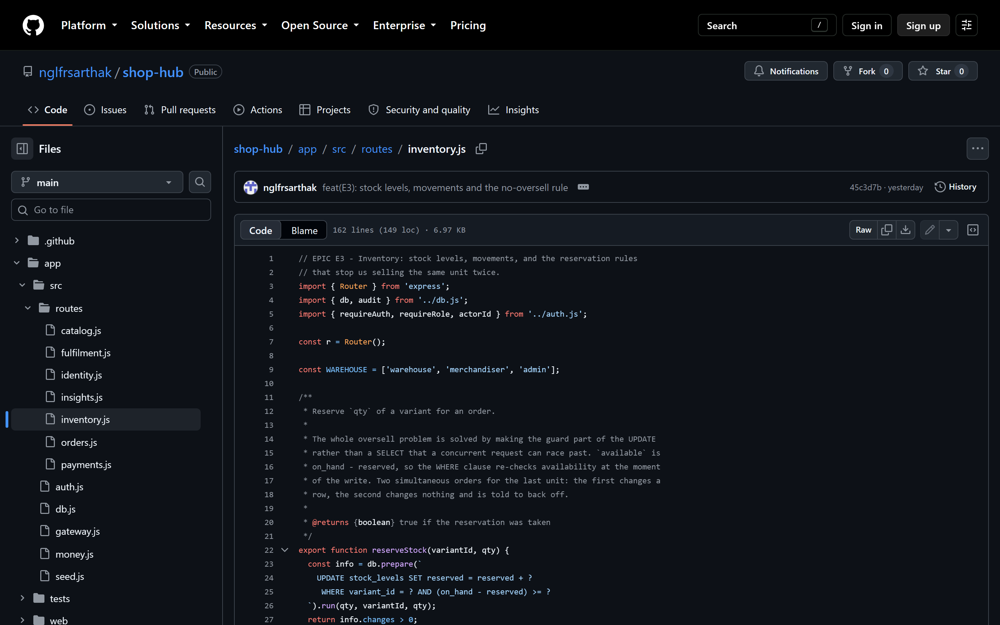

### §4.5 The workflow as code

CI is a single workflow, `.github/workflows/ci.yml`, triggered on every push and
pull request. It has three jobs, each with one reason to fail, so a red cross
always says what broke:

- **Tests** — install, run `npm test`, then start a real server and run the smoke
  test against it.
- **Lint** — parse every source file; fail if a signing key is hard-coded in
  application source; and assert the production guard, that production *refuses*
  to start without an explicit `JWT_SECRET`, *loads* when given one, and that a
  fresh clone still runs in development.
- **API contract** — start the API and assert its self-description from
  `GET /api/v1/meta`.

There is no deploy job. That is the "never CD" rule of §2.3, enforced by the
workflow's shape.

---

## 5. Running files — the console

The browser console is a vanilla-JS client served from the API's own origin. It
does no business logic: it renders what the API sends, and it maps the API's
error codes to clear messages. The screenshots below were captured by the
capture script signing in through the real sign-in form and clicking through the
real screens.

### §5.1 The sign-in gate

**SS-10 — Sign-in gate.**

| Field | Value |
|---|---|
| **Tool** | App console (`http://127.0.0.1:3010`) |
| **Where** | The landing screen |
| **Must show** | The six demo roles and the refusal notice |
| **Why** | The entry point for every role-scoped view in §2.9 |

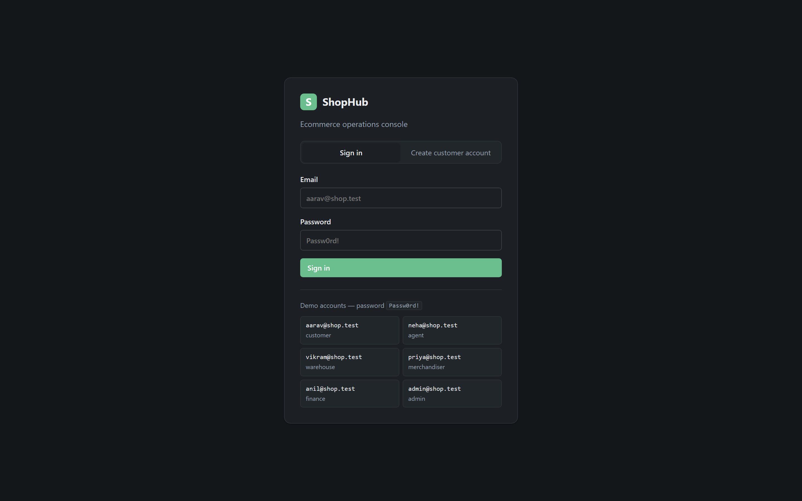

### §5.2 A customer's view

**SS-11 — Customer dashboard.**

| Field | Value |
|---|---|
| **Tool** | App console |
| **Where** | Sign in as a customer |
| **Must show** | Orders placed, lifetime spend, cart contents and open returns |
| **Why** | The role-chosen dashboard from §2.9 and E7 |

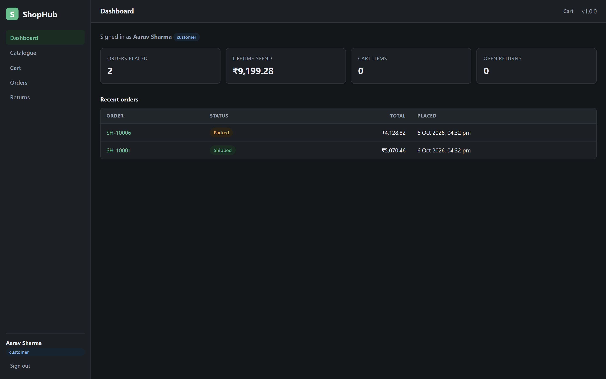

**SS-12 — Catalogue.**

| Field | Value |
|---|---|
| **Tool** | App console |
| **Where** | Catalogue |
| **Must show** | Search, category, sort, and live availability per SKU |
| **Why** | Availability is computed from stock, never stored (§2.5) |

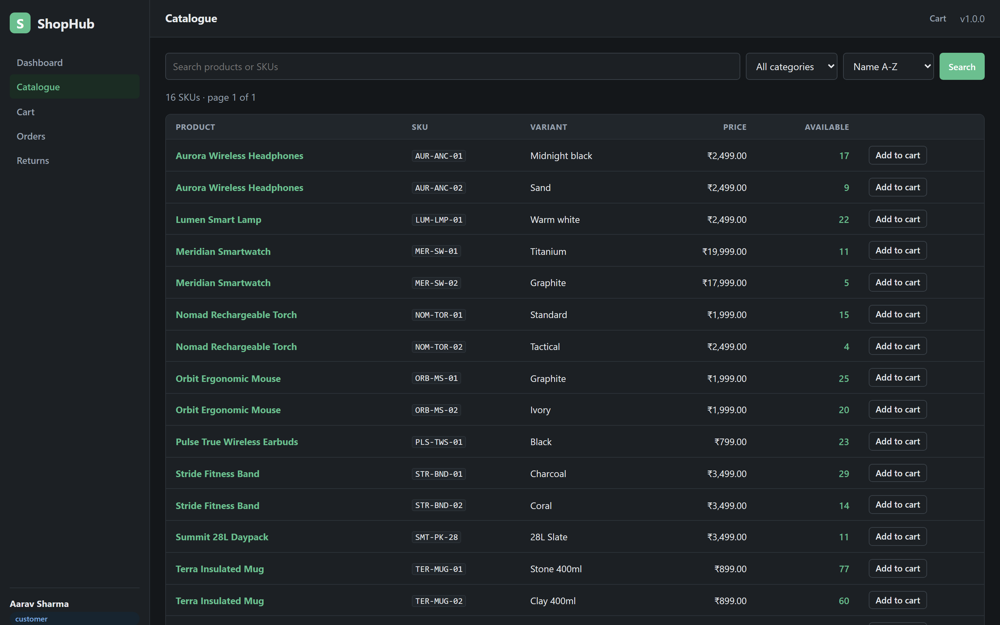

**SS-13 — A product with two SKUs.**

| Field | Value |
|---|---|
| **Tool** | App console |
| **Where** | A product page |
| **Must show** | Two SKUs, prices in paise, computed availability |
| **Why** | The money rule from §2.6 shown in the UI |

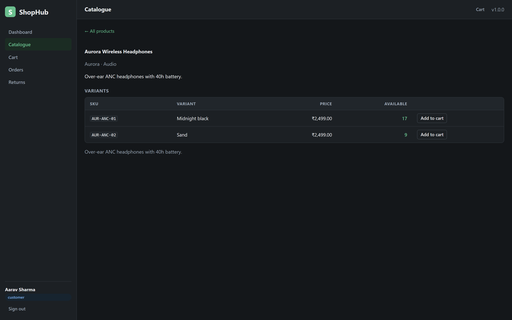

**SS-14 — Cart totals.**

| Field | Value |
|---|---|
| **Tool** | App console |
| **Where** | Cart |
| **Must show** | Subtotal, 18% GST, shipping and grand total — all integer paise |
| **Why** | The identity in §2.5 and the money rule in §2.6 |

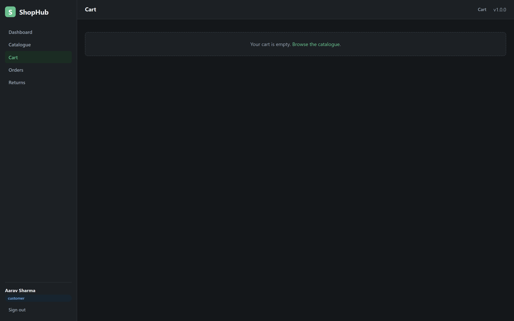

**SS-15 — Order list.**

| Field | Value |
|---|---|
| **Tool** | App console |
| **Where** | Orders |
| **Must show** | Only the signed-in customer's own orders |
| **Why** | Ownership scoping from §2.9 |

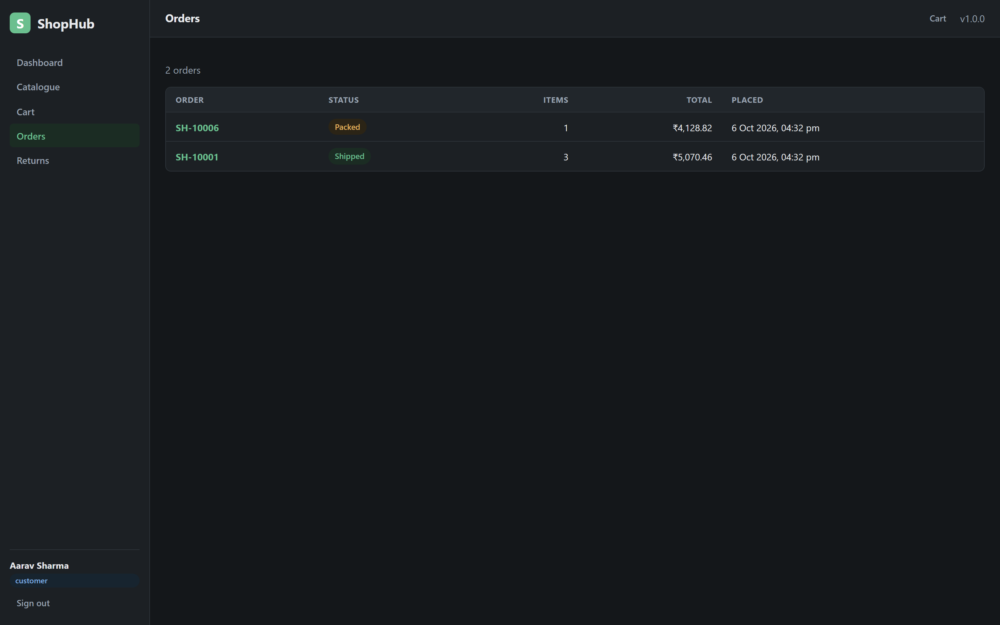

**SS-16 — Order detail.**

| Field | Value |
|---|---|
| **Tool** | App console |
| **Where** | An order |
| **Must show** | Snapshotted lines, totals, and the legal next states for the role |
| **Why** | The closed state machine from §2.7, surfaced to the user |

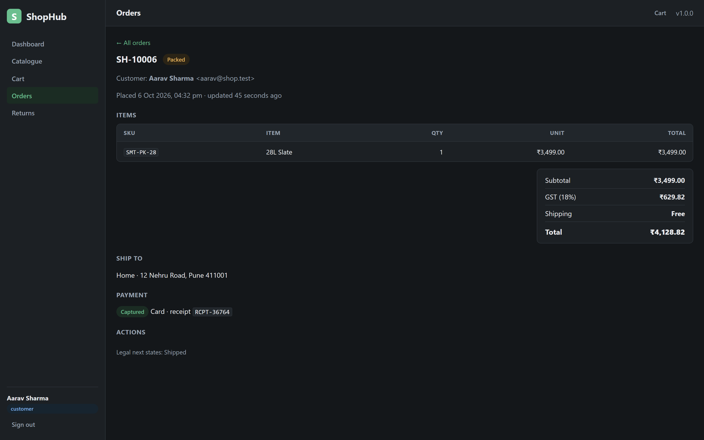

**SS-17 — A refusal that names the roles.**

| Field | Value |
|---|---|
| **Tool** | App console |
| **Where** | A customer navigating to an inventory route |
| **Must show** | A `403`; the error mapper names the roles that were needed |
| **Why** | Meaningful refusal from §2.9 |

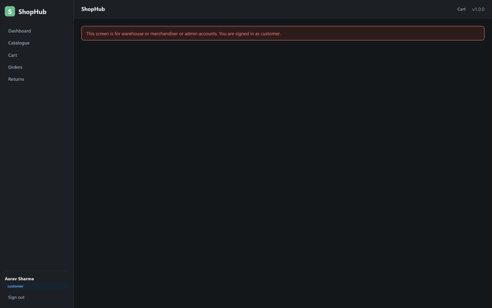

### §5.3 A warehouse operator's view

**SS-18 — Warehouse dashboard.**

| Field | Value |
|---|---|
| **Tool** | App console |
| **Where** | Sign in as a warehouse operator |
| **Must show** | On hand, reserved, below reorder point, packed orders |
| **Why** | The role-chosen dashboard and the invariant from §2.5 |

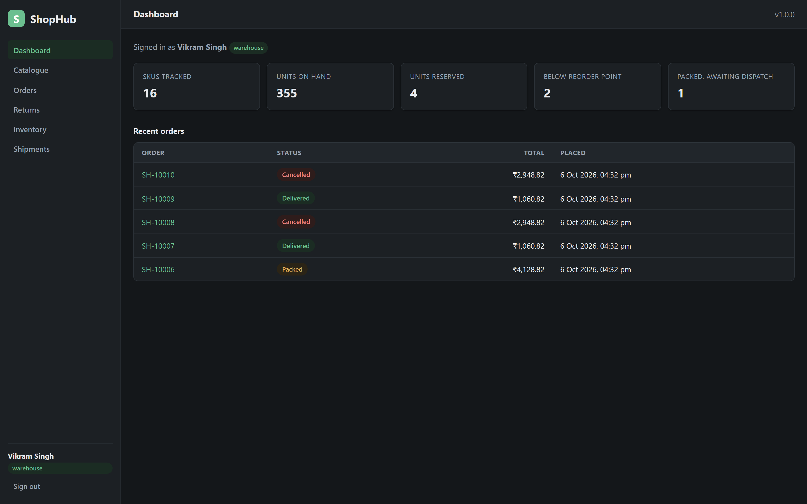

**SS-19 — Stock levels and the low-stock report.**

| Field | Value |
|---|---|
| **Tool** | App console |
| **Where** | Inventory |
| **Must show** | `on_hand − reserved` as availability, with the reorder point |
| **Why** | E3's low-stock rule and the §2.5 invariant |

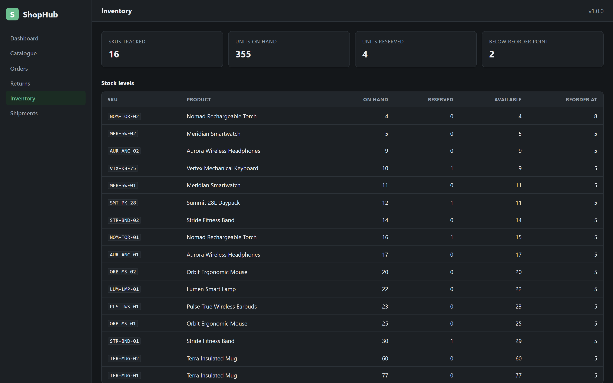

**SS-20 — The dispatch queue.**

| Field | Value |
|---|---|
| **Tool** | App console |
| **Where** | Shipments |
| **Must show** | Orders in `paid` or `picking`, oldest first, with the shipment events |
| **Why** | The new `GET /fulfilment/dispatch-queue` added to satisfy SCRUM-42 (§2.2) |

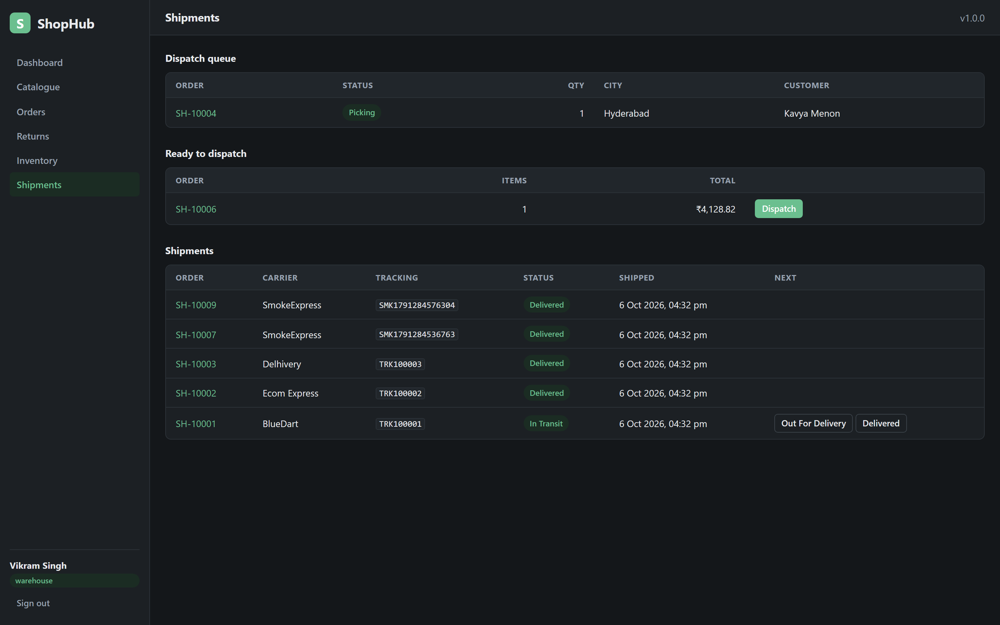

### §5.4 A finance view

**SS-21 — Reconciliation.**

| Field | Value |
|---|---|
| **Tool** | App console |
| **Where** | Sign in as finance → Payments |
| **Must show** | Gross captured, refunded and net settled, and the identity the API asserts |
| **Why** | The reconciliation identity from §2.5, asserted server-side so a mismatch fails the request |

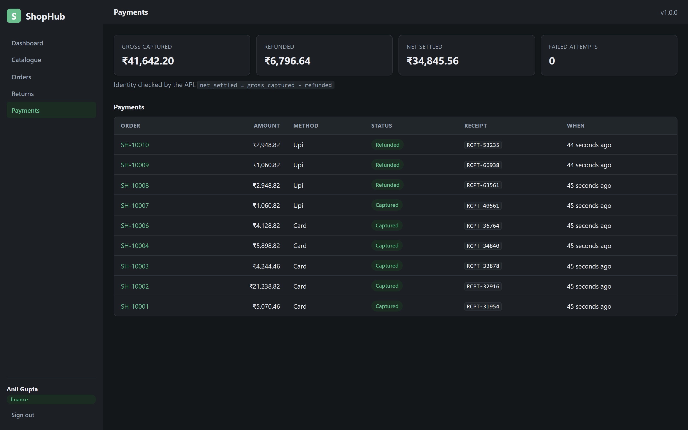

### §5.5 Returns and admin

**SS-22 — The returns board.**

| Field | Value |
|---|---|
| **Tool** | App console |
| **Where** | Returns |
| **Must show** | Each return with its legal next state, including `in_transit` |
| **Why** | The closed return sequence from §2.7, with the step added for SCRUM-41 |

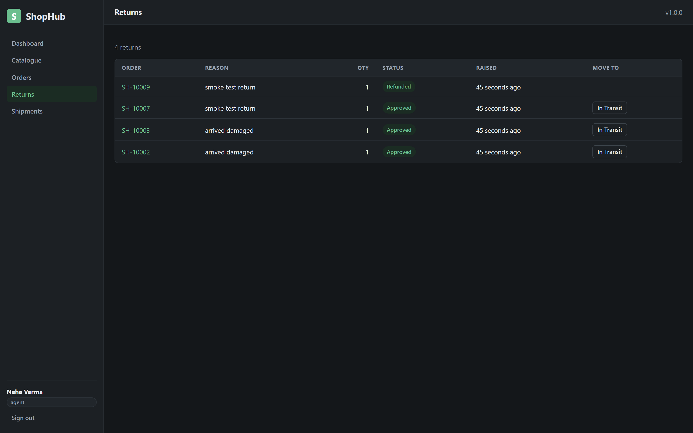

**SS-23 — Users and the audit ledger.**

| Field | Value |
|---|---|
| **Tool** | App console |
| **Where** | Sign in as admin |
| **Must show** | Provisioned staff accounts and the append-only audit ledger |
| **Why** | The audit invariant from §2.5 and the role scoping from §2.9 |

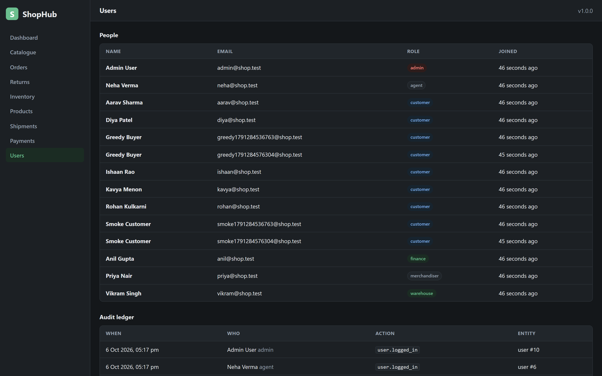

---

## 6. Code outputs

These are the real outputs of the real commands, captured byte for byte and
wrapped in a terminal-styled page. Each screenshot carries the exact command,
and the same output is reproduced verbatim as a code block where it is short
enough to be worth reading as text. If an image and its code block ever
disagree, the code block is the one to believe.

### §6.1 The acceptance suite

**SS-24 — `npm test`.**

| Field | Value |
|---|---|
| **Tool** | Terminal (Node test runner) |
| **Where** | `cd app && npm test` |
| **Must show** | **78 acceptance tests across 8 suites, all passing** |
| **Why** | The Definition of Done from §2.2: every acceptance criterion is a passing test |

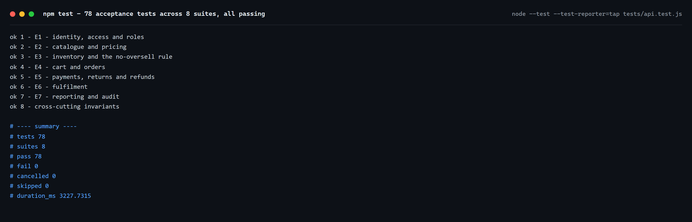

### §6.2 The API's self-description

**SS-25 — `GET /api/v1/meta`.**

| Field | Value |
|---|---|
| **Tool** | HTTP |
| **Where** | `curl http://127.0.0.1:3010/api/v1/meta` |
| **Must show** | The service name, integer-paise money, six roles, 51 endpoints, 18 tables |
| **Why** | The machine-readable shape of §1, and the contract the CI job asserts |

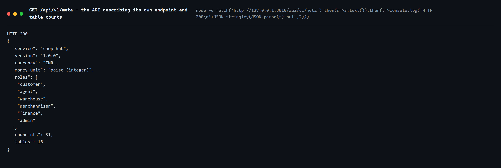

### §6.3 The console client's self-check

**SS-26 — `node scripts/console-check.mjs`.**

| Field | Value |
|---|---|
| **Tool** | Node |
| **Where** | `node scripts/console-check.mjs` |
| **Must show** | The formatter and error-mapper checks, and the live API calls, all passing |
| **Why** | The client half of §2.9 — error mapping — verified independently of the server suite |

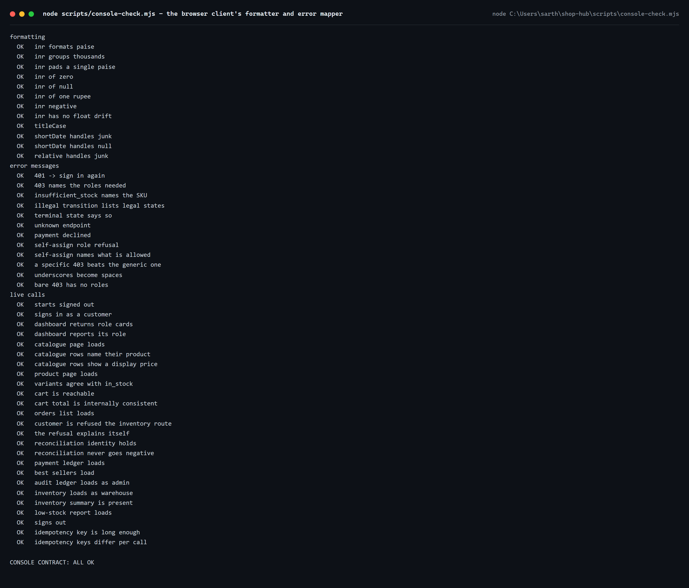

### §6.4 The CI run for the pushed commit

**SS-27 — the CI run.**

| Field | Value |
|---|---|
| **Tool** | GitHub Actions |
| **Where** | `gh run view` for the push of `deb5d0e` |
| **Must show** | The workflow jobs and their outcome — green |
| **Why** | The pipeline from §2.3, and the "one reason to fail per job" design from §4.5 |

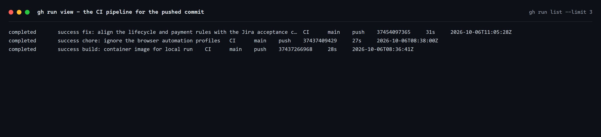

### §6.5 The commit history as text

**SS-28 — `git log --oneline`.**

| Field | Value |
|---|---|
| **Tool** | Git |
| **Where** | `git log --oneline` |
| **Must show** | The same history as SS-7, as text — one epic or fix per commit |
| **Why** | The "how" side of §2.1, in a form that can be read rather than seen |

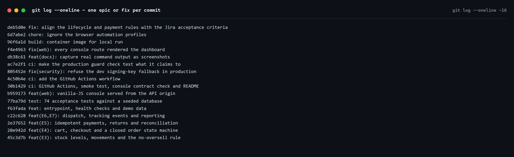

### §6.6 Red runs that were useful

Two historical CI runs are kept because they are honest: a red cross told the
team exactly what broke, and the fix is in the history.

**SS-29 — a first CI failure.**

| Field | Value |
|---|---|
| **Tool** | GitHub Actions |
| **Where** | `gh run view 37274485133 --log-failed` |
| **Must show** | Lint failing on a hard-coded `JWT_SECRET` |
| **Why** | The lint job from §4.5 doing exactly the job it exists for |

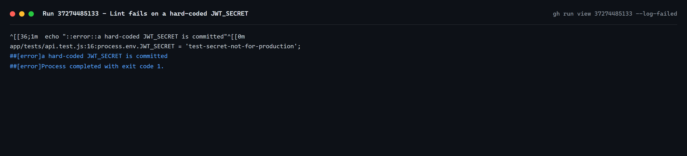

**SS-30 — a check that passed for the wrong reason.**

| Field | Value |
|---|---|
| **Tool** | GitHub Actions |
| **Where** | `gh run view` 37274799850, `--log-failed` |
| **Must show** | The replacement check failing because of a missing dependency, not the thing it claimed to test |
| **Why** | §2.4 in practice — a check that passes for the wrong reason is worse than no check, so it was fixed to fail for the right one |

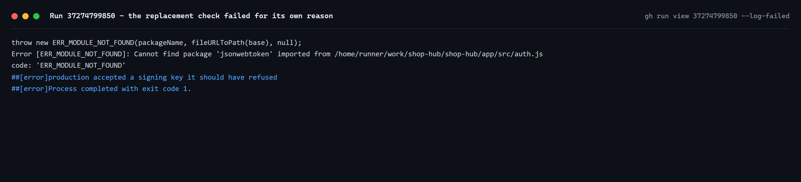

### §6.7 The live smoke test

**SS-31 — the smoke test.**

| Field | Value |
|---|---|
| **Tool** | Terminal |
| **Where** | `node scripts/smoke-test.mjs http://127.0.0.1:3010` |
| **Must show** | 30 checks over real HTTP against a running server, all passing |
| **Why** | End-to-end verification of the running system, the top of the test pyramid from §2.4 |

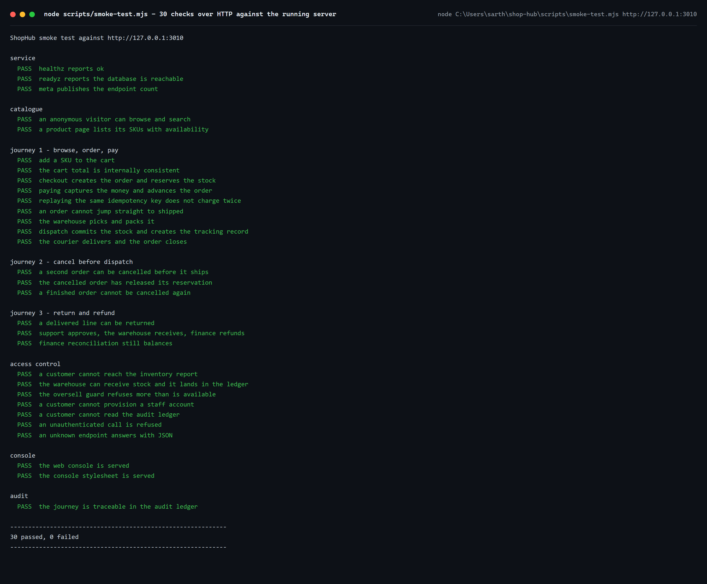

---
## 7. Conclusion

ShopHub is a complete trading loop for an online retailer, built the way the lab
prescribes: the work lived in **Jira**, the code lived in **GitHub**, and CI
verified every push and nothing more. The final audit compared all 53 acceptance
criteria of the 16 open stories against the code, made the small set of changes
needed to align them, and moved every story to Done. The evidence in this
document — the board, the repository, the running console and the real command
output — was captured from the tools themselves, and the one gap, the burndown
chart, is stated plainly rather than papered over with a drawing.
